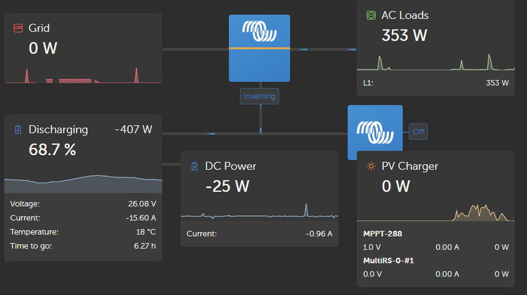

# dbus-mppsolar

DBus VenusOS driver for MPPSolar inverter or any compatible one.

## What does it do?

After installing this to VenusOS. Venus will be able to auto-connect
to inverters that follow MPPSolar protocols though a USB-Serial interface.

It will automatically spawn the inverter in a very similar way to Victron
Multi inverters, and will support controlling the inverter trough VRM.



# Install Instructions

## Prepare Venus OS (optional):

You may need to install GIT and python by doing:

```
/opt/victronenergy/swupdate-scripts/set-feed.sh release 
opkg update
opkg install python3-pip git
pip3 instal mpp-solar # Not needed because this repo uses it as a submodule
```

## Clone GIT & submodules on Venus OS:

```
git clone --recurse-submodules https://github.com/DarkZeros/dbus-mppsolar /data/etc/dbus-mppsolar
```

Now install the service to the VenusOS to allow starting it when needed:
```
cp -R /data/etc/dbus-mppsolar/service /opt/victronenergy/service-templates/dbus-mppsolar
```

Add the service to the starter rules, this will autostart the service on new USB-Serial connections with any compatible inverter. Modify `/etc/venus/serial-starter.conf` add a new service in the list of services, and add it to the default list of service handlers at the start (`mppsolar:gps:...:vedirect`).

Here how it should look like:
```
...
service mppsolar        dbus-mppsolar
...
alias   rs485           mppsolar:cgwacs:fzsonick:imt:modbus
alias   default         mppsolar:gps:vedirect 
...
```

# What does this repo depend on

  * Need velib_python for execution of the service
  * Need mpp-solar to communicate with Inverter


# What inverters are supported?

  * Inverters that follow the PI30 protocol, or PI30MAX
  * The rest, are not yet parsed, but feel free to implement the update()/change() functions for them :)
